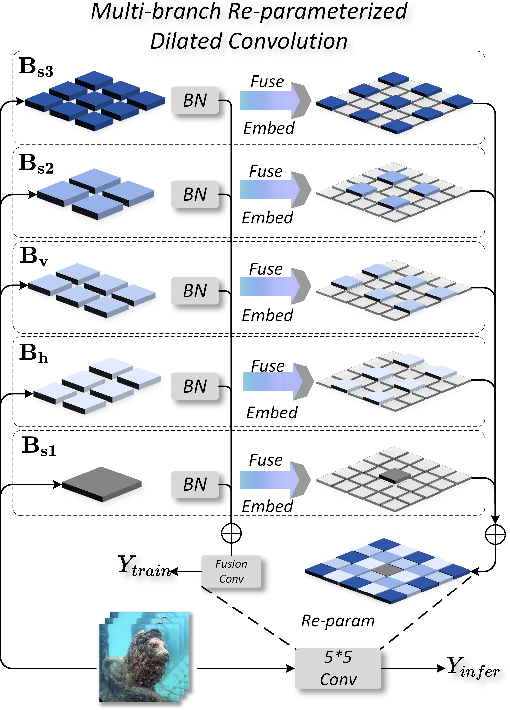

# Color Back, Model Light

Official implementation of **"Color Back, Model Light: An Efficient Framework for Real-Time Underwater Image Enhancement and Beyond"**.

 
 

# 🔥 Highlights

- **Ultra-lightweight model**
  - Only **3.88K parameters**
  - **0.145 GFLOPs**
- **Real-time performance**
  - **409 FPS on GPU**
  - **25 FPS on NVIDIA Jetson Orin NX**
- **Strong enhancement capability**
  - Superior performance on **8 underwater datasets**
  - **29.7% improvement in UCIQE** under real underwater conditions
- **Practical deployment**
  - Successfully deployed on **ROV platform**
  - Improves **downstream instance segmentation performance**

 
 

## 🧠 Method
### Overall Framework

  

### MRDConv

  

 
 

# 📷 Visual Results

- [Internal_vis](Figs/02_vis.pdf)
- [Visual_1](Figs/06_compare1.pdf)
- [Visual_2](Figs/07_compare2.pdf)
- [Visual_3](Figs/08_compare3.pdf)
- [Ablation_1](Figs/03_ab1.pdf)
- [Ablation_2](Figs/04_ab2.pdf)
- [Ablation_3](Figs/05_ab3.pdf)
- [Instance seg](Figs/11_UIIS.pdf)

Our method produces:

- more natural colors
- clearer textures
- stable contrast across different underwater scenes

 
 

# 🌊 Real-world Deployment

We conducted experiments in:

- **Controlled water tank**
- **Qiandao Lake ROV platform**

- [Underwater camera](Figs/09_camera.pdf)
- [Rov](Figs/10_rov.pdf)
- [Camera seg](Figs/12_seg.pdf)
  

Results show significant improvements in:

- visibility
- feature extraction
- feature matching stability

 
 

# 📦 Datasets

Experiments are conducted on the following datasets:

| Dataset | Images | Link |
| ------- | ------ |------|
| UIEB    | 890    |[UIEB](https://arxiv.org/pdf/1901.05495.pdf)|
| LSUI    | 4,279  |[LSUI](https://arxiv.org/pdf/2111.11843)|
| EUVP-D  | 2,185  |[EUVP-D](https://ieeexplore.ieee.org/document/9001231)|
| EUVP-I  | 5,500  |[EUVP-I](https://ieeexplore.ieee.org/document/9001231)|
| EUVP-S  | 3,700  |[EUVP-S](https://ieeexplore.ieee.org/document/9001231)|

Additional generalization tests:
- [U45](https://arxiv.org/abs/1906.06819) 
- [RUIE](https://arxiv.org/abs/1901.05320)
- [ColorChecker7](https://github.com/kaibopiggy/two-No-reference-image-dataset/tree/main/Color-Check7)

 
 

# 🙏 Acknowledgement

This work was supported by:

- **Institute of Artificial Intelligence (TeleAI), China Telecom**

 
 

# 📄 Citiation

If you find this work useful, please cite:
